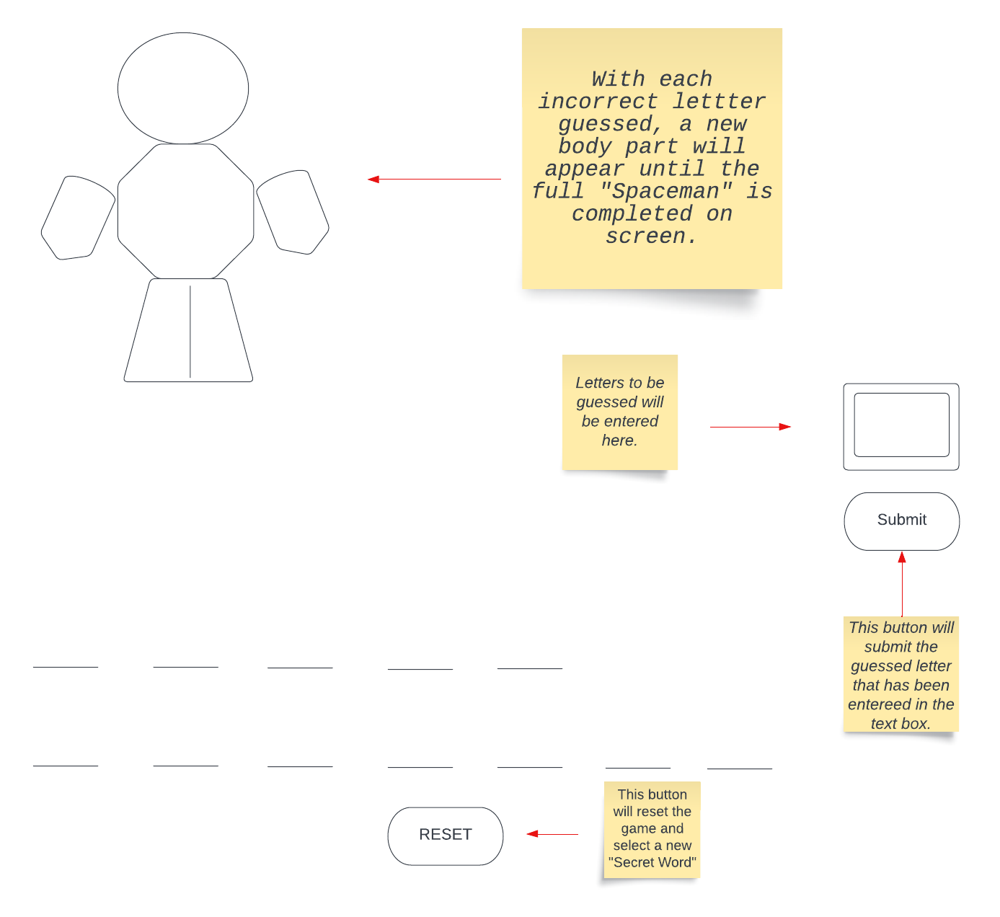

# Spaceman Game

## Gameplay: 
The user will have a random word assigned for the round and multiple blank spaces will be displayed on the screen indicating the amount of letters in the "Secret Word". The user will then type their guess for a single letter that may or may not be in the word. The submit button will be pressed in order to establish the guessed character. If the letter guessed is a part of the "Secret Word", the letter will appear in the corresponding blank and the user will proceed to guess the next letter. If the letter that is guessed is not in the "Secret Word", then an individual body part of the "Spaceman" will form. You will have up to 6 incorrect guesses before the game will notify you that you have lost. If you correctly guess the word without using all of 6 failed opportunities, then the game will notify you that you have won! If the user decides to restart the game and have a new random word generated, then they will need to click the "Reset" button which will restart the the game and generate a new random word. 

## User Stories:
> "As a user, I would like to..."
* Freely enter my character guesses into the text box
* See the appendages of the "Spaceman" to form when incorrect guesses are made.
* See the correctly guessed characters appear in their respective blanks.
* Show a message indicating when the "Secret Word" has been correctly guessed.
* Show a message if the "Secret Word" was not correctly guessed and have subsequently lost.
* Have the ability to reset the game and generate a new word when the "Reset" button has been clicked. 
    

## Stretch Goals
> "As a creator, I would like to..."
* Give the player an option to input their own "Secret Words" to enable multiplayer gameplay.
* Have "Spaceman" themed images.
* Have interactive sounds when buttons are clicked and characters are entered.

## Technologies used: 
* HTML 
* CSS 
* Javascript

## Wire Frame


## Pseudocode:
> "Create..."
``` input/text box for character guesses
``` list for random generated words math.random
``` conditional for correct and incorrect guesses including adding Spaceman appendages
``` messages when word is guessed correctly/incorrectly using conditionals and returns
``` document.eventListener for when the "Reset" button is clicked and create
a conditional and assign it math.random to generate new word and reset game.
``` document.eventListener for when the "Submit" button is clicked in order to submit guessed character.


